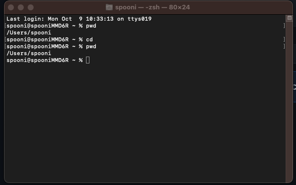

**An example of using the cd command with no arguments**

The working directory is /users/spooni when the command was run. When you run the cd command without arguments the working directory would change to the home directory of the user. The ouput is not an error.

**An example of using the cd command with a path to the director as an argument**

The current working directory is /users/spooni. We we do a cd to Movies directory, the current workijg directory becomes /users/spooni/Movies. The output is not an error.
