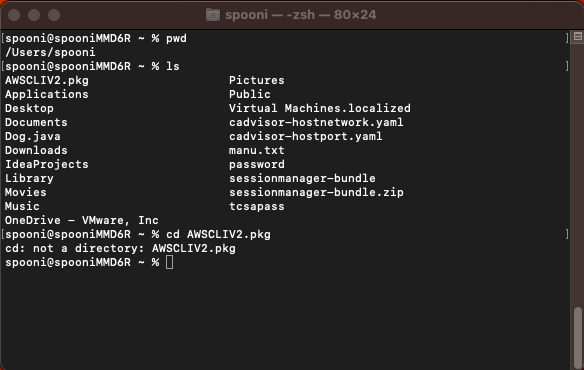
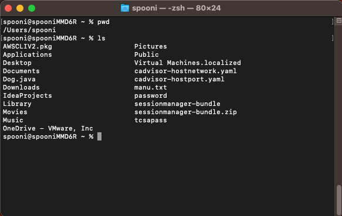
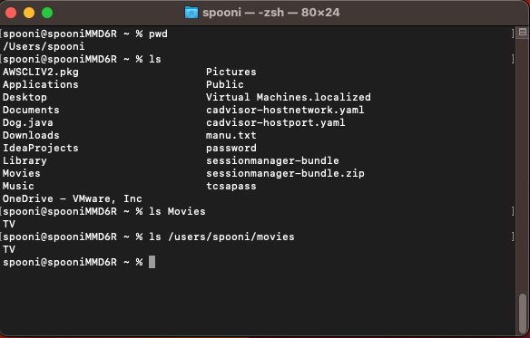
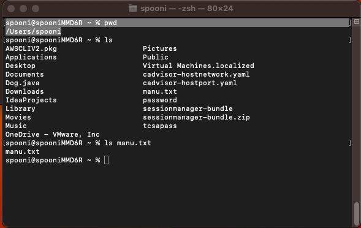
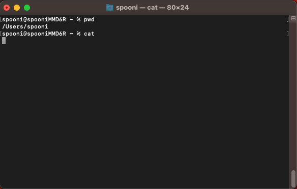
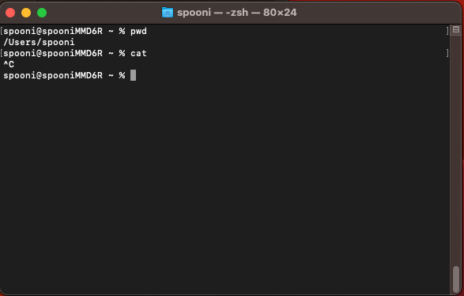
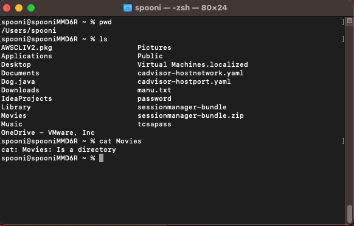
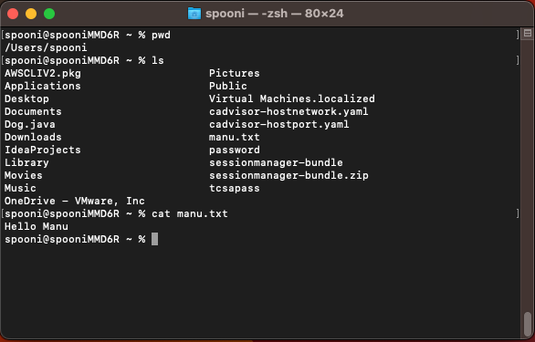

# **1. An example of using the cd command with no arguments**

*The working directory is /users/spooni when the command was run. When you run the cd command without arguments the working directory would change to the home directory of the user. The ouput is not an error.*

'''
print 'indent 4 spaces'
'''

# **2. An example of using the cd command with a path to the directory as an argument**

The current working directory is /users/spooni. We do a cd to the Movies directory, the current working directory becomes /users/spooni/Movies. The output is not an error.

# **3. An example of using the cd command with a path to a file as an argument**

The current working directory is /users/spooni. When you run the cd command with  path to a file as argument as in this case AWSCLIV2.pkg you will get an error. The current working directory remains the same as /Users/spooni. The error would say the argument provided to cd is not a directory.

# **4. An example of using the ls command with no arguments**

The working directory is /users/spooni when the command was run. When you run the ls command without arguments it lists the contents of the current working directory. The ouput is not an error.

# **5. An example of using the ls command with a path to the directory as an argument**

The current working directory is /users/spooni. We do a ls of the Movies directory. It list the contents of the Movies directory including the files and directories.The output is not an error.

# **6. An example of using the ls command with a path to a file as an argument**

The current working directory is /users/spooni. When you run the ls command with  path to a file as argument as in this case manu.txt it will list the file. The output is not an error.

# **7. An example of using the cat command with no arguments**

The working directory is /users/spooni when the command was run. When you run the cat command without arguments it with hang expecting a file as input. You have to exit by pressing control-c on the terminal. The ouput is an error and it will hang.

# **8. An example of using the cat command with a path to the directory as an argument**

The current working directory is /users/spooni. We do a cat of the Movies directory it results in the error. The cat command will complain it is a directory. The output is not an error.

# **9. An example of using the cat command with a path to a file as an argument**

The current working directory is /users/spooni. When you run the cat command with path to a file as argument as in this case manu.txt it will list the contents of the file. The output is not an error.
